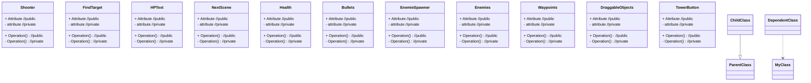

```mermaid


classDiagram

class Shooter{
    + Attribute     //public
    - attribute     //private
    + Operation()   //public
    - Operation()   //private
}

class FindTarget{
    + Attribute     //public
    - attribute     //private
    + Operation()   //public
    - Operation()   //private
}

class HPText{
    + Attribute     //public
    - attribute     //private
    + Operation()   //public
    - Operation()   //private
}

class NextScene{
    + Attribute     //public
    - attribute     //private
    + Operation()   //public
    - Operation()   //private
}

class Health{
    + Attribute     //public
    - attribute     //private
    + Operation()   //public
    - Operation()   //private
}

class Bullets{
    + Attribute     //public
    - attribute     //private
    + Operation()   //public
    - Operation()   //private
}

class EnemieSpawner{
    + Attribute     //public
    - attribute     //private
    + Operation()   //public
    - Operation()   //private
}

class Enemies{
    + Attribute     //public
    - attribute     //private
    + Operation()   //public
    - Operation()   //private
}

class Waypoints{
    + Attribute     //public
    - attribute     //private
    + Operation()   //public
    - Operation()   //private
}

class DraggableObjects{
    + Attribute     //public
    - attribute     //private
    + Operation()   //public
    - Operation()   //private
}

class TowerButton{
    + Attribute     //public
    - attribute     //private
    + Operation()   //public
    - Operation()   //private
}

ChildClass --|> ParentClass


DependentClass ..> MyClass


```