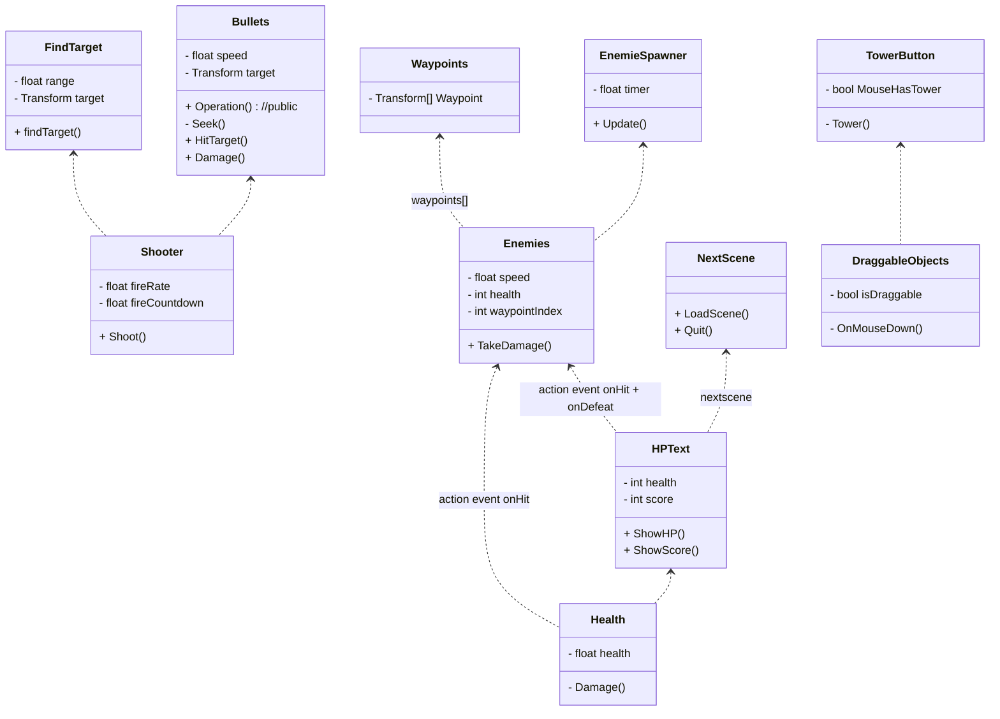

```mermaid


classDiagram

class Shooter{
    - float fireRate
    - float fireCountdown
    + Shoot()

}

class FindTarget{
    - float range
    - Transform target
    + findTarget()
}

class HPText{
    - int health
    - int score
    + ShowHP()
    + ShowScore()
}

class NextScene{
    + LoadScene()
    + Quit()
}

class Health{
    - float health
    - Damage()
}

class Bullets{
    - float speed
    - Transform target
    + Operation()   //public
    - Seek()
    + HitTarget()
    + Damage()
}

class EnemieSpawner{
    - float timer
    + Update()
}

class Enemies{
    - float speed
    - int health
    - int waypointIndex
    + TakeDamage()
}

class Waypoints{
    - Transform[] Waypoint   
}

class DraggableObjects{
    - bool isDraggable
    - OnMouseDown()
}

class TowerButton{
    - bool MouseHasTower
    - Tower()
}

Waypoints <.. Enemies : waypoints[]

EnemieSpawner <.. Enemies

TowerButton <.. DraggableObjects

Enemies <.. Health : action event onHit

HPText <.. Health

Enemies <.. HPText : action event onHit + onDefeat

NextScene <.. HPText : nextscene

FindTarget <.. Shooter

Bullets <.. Shooter


```